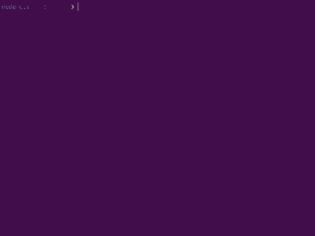

# Solid Node CLI utilities

`@solid-js/cli` is a very simple node library to show small running tasks and messages in any terminal. 
Only dependency is [Chalk](https://www.npmjs.com/package/chalk) for text transforms and colors.
This lib does not handle user input, so we advice to use [Inquirer](https://www.npmjs.com/package/inquirer) to manage them.



This gif is recorded from [demo.js](https://github.com/solid-js/solid/tree/master/libraries/node-cli/demo.js). 


### Installation

To install Nanostache in your Node project :<br>
```shell
npm install @solid-js/cli
```
or
```shell
yarn add @solid-js/cli
```


### Import

```javascript
const { createSpaces, print, offset, ... } = require('@solid-js/cli');
```


### Print

Print some content to the `stdout`, with bold and same line options.
Set `newLine` to false to disable trailing `\n\r`. Useful if you need to append some texts on the same line after.

```javascript
print(content, bold = false, newLine = true);
```


### Offset

Returns an offset text with leading spaces.

```javascript
const offsetText = offset(3, 'My offset');
// '   My offset'
```

### New line

Write a new line to `stdout`

```javascript
newLine();
```

### Halt

Show a message in red and bold to `stderr`. Exit current process. Exit
code can be overridden, default exit code is 1.

```javascript
halt('This is a pretty big error')
```

### Exec

Run any shell command synchronously.

```javascript
const result = exec('ls -la');
```

Wrap in try catch to get errors.

```javascript
let result;
try
{
    result = exec('./custom-command.sh');
}
catch ( e )
{
    halt( e );
}
print( result );
```

By default, `stdout` and `stderr` are hidden. To change this behavior,
Set stdLevel to :
- 0 (default) : No `stdout` and `stderr` are shown. Use return and try / catch to get them.
- 1 : Only `stdout` is shown
- 2 : Only `stderr` is shown
- 3 : Both `stdout` and `stderr` are shown

Know more about options :
- see [NodeJS exec options doc](https://nodejs.org/api/child_process.html#child_process_child_process_execsync_command_options))
- see [NodeJS stdio doc](https://nodejs.org/api/child_process.html#child_process_options_stdio)

```javascript
exec('command');
// No stdout and stderr shown, use return and try / catch to get them
```

```javascript
const result = exec('command', 2);
// Only stderr are shown. Stdin is in result
```

```javascript
// Setting custom options
exec('command', {
    cwd: 'otherDirectory/'
});
```


### Task

```javascript
// Create and show a new task on CLI
const spriteTask = task('Building sprites');
// ➤ Building sprites ...
```

```javascript
// Set to success
spriteTask.success();
// ✔ Building sprites
```

```javascript
// Set to success with updated text
spriteTask.success(`Built ${ total } sprites`);
// ✔ Built 12 sprites
```


##### Task error

```javascript
task.error( errorObject, code = 0 );
```
First argument `errorObject` can be :
- null (will print nothing)
- a string
- an object containing stdout and stderr properties
- an error object

Second argument `code` will exit if `code > 0`. Note : `process.exit`
can be hooked with `hookStandards()`.

```javascript
// Set to error
spriteTask.error();
// ✘ Building sprites
```

```javascript
// Set to error, show message to stderr and exit process 
spriteTask.error( myError, 1 );
// ✘ Building sprites
// Error message
```

##### Task progress

Show a progress bar next to the current task. Width can be set, default
width is 30px.

```javascript
spriteTask.progress( 3, 12 ) // 3 per 12 is 3 / 12
// ✔ Building ██░░░░░░░░░░░░
```

```javascript
spriteTask.progress( 3, 3 ) // 3 per 3 is 1
// ✔ Building ██████████████
```

```javascript
spriteTask.progress( 1, 100, 50 ) // 1 per 100
// ✔ Building █░░░░░░░░░░░░░░░░░░░░░░░░░░░░░░░░░░░░░
```


### Table

Will show a nice table to the CLI

```javascript
const data = [
    ['File', 'Size', 'Is a module'],
    ['test.js', 534, true],
    ['other-file.js', 1535, false],
    ['data.js', 42, false],
    ['test.js', 534, true]
];
table( data, true ); // first line are labels
```

```javascript
// With some display options
table( data, firstLineAreLabels = false, sep = ' | ', lineStart = ' ', lineEnd = '', minColumnWidths = [40, 20, 20]);
```


### Tests

```javascript
const { test } = require('@solid-js/cli');

// Here we are starting a new cli task
test("My lib's feature", it =>
{
    // It is a function to declare list of assertions
    // Every "it" will add a progress bar to the current task
    // Every "it" can be sync or async it does not matter
    
    it('sould return 42', assert =>
    {
        // Here we call our tested method / lib
        const result = myLib.doStuff();
        
        // The assertion will fail if the result is not exactly 42
        assert( result, 42 );
    });
    
    it('sould throw error', assert => 
    {
        // We try error throw for example here
        // Assertion will fail if our lib does not throw expected error
        try
        {
            myLib.doStuff('invalid parameter');
        }
        catch (e)
        {
            assert( e instanceof Error );
            return;
        }
        assert( false );
    });
    
    // Every test will stop and process will quit with an error code
    // If any assertion have failed.
});

// Will wait previous test to start ...
test("Another test", it =>
{
    // ...
})
```